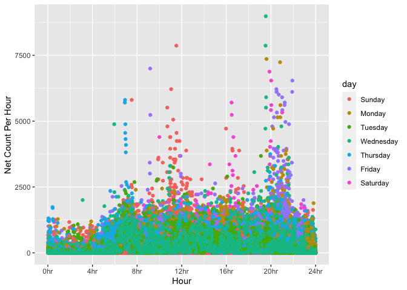
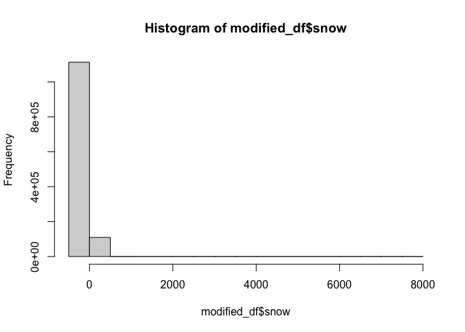
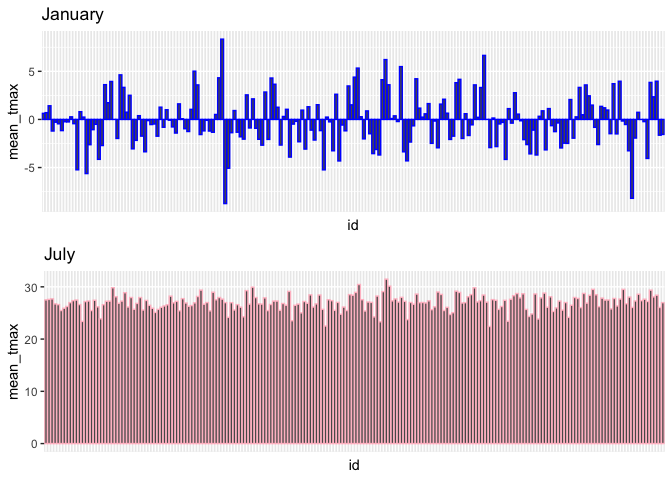
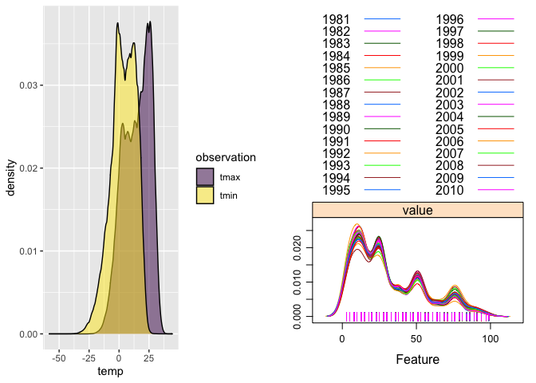

P8105 HW3 \| Jagjit Singh \| ID: JS5958
================
2022-10-11

``` r
library(p8105.datasets)
library(dplyr)
```

    ## 
    ## Attaching package: 'dplyr'

    ## The following objects are masked from 'package:stats':
    ## 
    ##     filter, lag

    ## The following objects are masked from 'package:base':
    ## 
    ##     intersect, setdiff, setequal, union

``` r
library(tidyverse)
```

    ## ── Attaching packages
    ## ───────────────────────────────────────
    ## tidyverse 1.3.2 ──

    ## ✔ ggplot2 3.3.6     ✔ purrr   0.3.5
    ## ✔ tibble  3.1.8     ✔ stringr 1.4.1
    ## ✔ tidyr   1.2.1     ✔ forcats 0.5.2
    ## ✔ readr   2.1.3     
    ## ── Conflicts ────────────────────────────────────────── tidyverse_conflicts() ──
    ## ✖ dplyr::filter() masks stats::filter()
    ## ✖ dplyr::lag()    masks stats::lag()

``` r
library(ggridges)
library(grid)
library(gridExtra)
```

    ## 
    ## Attaching package: 'gridExtra'
    ## 
    ## The following object is masked from 'package:dplyr':
    ## 
    ##     combine

``` r
library(caret)
```

    ## Loading required package: lattice
    ## 
    ## Attaching package: 'caret'
    ## 
    ## The following object is masked from 'package:purrr':
    ## 
    ##     lift

### Problem 1

#### Read in the data

``` r
data("instacart")

instacart = 
  instacart %>% 
  as_tibble(instacart)
```

#### Answer questions about the data

This dataset contains 1384617 rows and 15 columns, with each row
resprenting a single product from an instacart order. Variables include
identifiers for user, order, and product; the order in which each
product was added to the cart. There are several order-level variables,
describing the day and time of the order, and number of days since prior
order. Then there are several item-specific variables, describing the
product name (e.g. Yogurt, Avocado), department (e.g. dairy and eggs,
produce), and aisle (e.g. yogurt, fresh fruits), and whether the item
has been ordered by this user in the past. In total, there are 39123
products found in 131209 orders from 131209 distinct users.

Below is a table summarizing the number of items ordered from aisle. In
total, there are 134 aisles, with fresh vegetables and fresh fruits
holding the most items ordered by far.

``` r
instacart %>% 
  count(aisle) %>% 
  arrange(desc(n))
```

    ## # A tibble: 134 × 2
    ##    aisle                              n
    ##    <chr>                          <int>
    ##  1 fresh vegetables              150609
    ##  2 fresh fruits                  150473
    ##  3 packaged vegetables fruits     78493
    ##  4 yogurt                         55240
    ##  5 packaged cheese                41699
    ##  6 water seltzer sparkling water  36617
    ##  7 milk                           32644
    ##  8 chips pretzels                 31269
    ##  9 soy lactosefree                26240
    ## 10 bread                          23635
    ## # … with 124 more rows

Next is a plot that shows the number of items ordered in each aisle.
Here, aisles are ordered by ascending number of items.

``` r
instacart %>% 
  count(aisle) %>% 
  filter(n > 10000) %>% 
  mutate(aisle = fct_reorder(aisle, n)) %>% 
  ggplot(aes(x = aisle, y = n)) + 
  geom_point() + 
  labs(title = "Number of items ordered in each aisle") +
  theme(axis.text.x = element_text(angle = 60, hjust = 1))
```

<!-- -->

Our next table shows the three most popular items in aisles
`baking ingredients`, `dog food care`, and `packaged vegetables fruits`,
and includes the number of times each item is ordered in your table.

``` r
instacart %>% 
  filter(aisle %in% c("baking ingredients", "dog food care", 
                      "packaged vegetables fruits")) %>%
  group_by(aisle) %>% 
  count(product_name) %>% 
  mutate(rank = min_rank(desc(n))) %>% 
  filter(rank < 4) %>% 
  arrange(desc(n)) %>%
  knitr::kable()
```

| aisle                      | product_name                                  |    n | rank |
|:---------------------------|:----------------------------------------------|-----:|-----:|
| packaged vegetables fruits | Organic Baby Spinach                          | 9784 |    1 |
| packaged vegetables fruits | Organic Raspberries                           | 5546 |    2 |
| packaged vegetables fruits | Organic Blueberries                           | 4966 |    3 |
| baking ingredients         | Light Brown Sugar                             |  499 |    1 |
| baking ingredients         | Pure Baking Soda                              |  387 |    2 |
| baking ingredients         | Cane Sugar                                    |  336 |    3 |
| dog food care              | Snack Sticks Chicken & Rice Recipe Dog Treats |   30 |    1 |
| dog food care              | Organix Chicken & Brown Rice Recipe           |   28 |    2 |
| dog food care              | Small Dog Biscuits                            |   26 |    3 |

Finally is a table showing the mean hour of the day at which Pink Lady
Apples and Coffee Ice Cream are ordered on each day of the week. This
table has been formatted in an untidy manner for human readers. Pink
Lady Apples are generally purchased slightly earlier in the day than
Coffee Ice Cream, with the exception of day 5.

``` r
instacart %>%
  filter(product_name %in% c("Pink Lady Apples", "Coffee Ice Cream")) %>%
  group_by(product_name, order_dow) %>%
  summarize(mean_hour = mean(order_hour_of_day)) %>%
  spread(key = order_dow, value = mean_hour) %>%
  knitr::kable(digits = 2)
```

    ## `summarise()` has grouped output by 'product_name'. You can override using the
    ## `.groups` argument.

| product_name     |     0 |     1 |     2 |     3 |     4 |     5 |     6 |
|:-----------------|------:|------:|------:|------:|------:|------:|------:|
| Coffee Ice Cream | 13.77 | 14.32 | 15.38 | 15.32 | 15.22 | 12.26 | 13.83 |
| Pink Lady Apples | 13.44 | 11.36 | 11.70 | 14.25 | 11.55 | 12.78 | 11.94 |

# PROBLEM 2

## Subpart 1

Loading the data, and cleaning it:

``` r
accel_df = read_csv('/Users/jag/Downloads/accel_data.csv') %>%
  janitor::clean_names() 
```

    ## Rows: 35 Columns: 1443
    ## ── Column specification ────────────────────────────────────────────────────────
    ## Delimiter: ","
    ## chr    (1): day
    ## dbl (1442): week, day_id, activity.1, activity.2, activity.3, activity.4, ac...
    ## 
    ## ℹ Use `spec()` to retrieve the full column specification for this data.
    ## ℹ Specify the column types or set `show_col_types = FALSE` to quiet this message.

Now we will fetch the dimensions and the variables. Following that we
will wrangle the data:

``` r
vars_accel = 
  accel_df %>% names()

dim_accel = 
  accel_df %>% dim()

modified_df <-
  accel_df %>%
  pivot_longer(
    activity_1:activity_1440,
    names_to = "minute",
    names_prefix = "activity_",
    values_to = "activity_count")

modified_df <- 
  modified_df %>%
  mutate(
    day = factor(day, levels = c("Sunday","Monday", "Tuesday", "Wednesday", 
                                 "Thursday", "Friday", "Saturday")),
    minute = as.integer(minute),
    hour = as.integer(minute %/% 60), 
    week = as.integer(week), 
    weekday_vs_weekend = 
      case_when(
           day %in% c("Monday", "Tuesday", "Wednesday", "Thursday", "Friday") 
           ~ "Weekday", 
           day %in% c("Saturday", "Sunday") ~ "Weekend"),
    day_id = as.integer(day_id)) 


vars_modified = 
  modified_df %>% names()

dim_modified = 
  modified_df %>% dim()
```

We took the initial dataset and performed modifications (pivot, mutate)
as per the question requirements which would help us analyse the data
and extract more meaning out of it. The modified data set had dimensions
**\[50400, 7\]** \[rows, columns\] and whereas the original data has
dimensions **\[35, 1443\]**.

The data is essentially 5 weeks of readings from an accelerometer worn
be 63 year-old male with BMI 25, who was admitted to the Advanced
Cardiac Care Center of Columbia University Medical Center and diagnosed
with congestive heart failure (CHF).

The readings are the activity counts in a short period; one-minute
intervals. From the modified data, which has a dimension of **\[50400,
7\]** we can see that a total of 50400 minutes have been recorded which
are the number of rows of the modified data due to our pivot. Our
original dataset has dimension **\[35, 1443\]** as stated previously
too.

Also, the patient has been observed over a total of 35 days. We can
verify it as $24*35*60$ = $50400$. Also, there are 1440 activities in
the initial data which are the total number of minutes in a day. In
terms of variables of the modified dataset. The key variables in the
tidied data are **\[week, day_id, day, minute, activity_count, hour,
weekday_vs_weekend\]**

## Subpart 2

Now we aggregate across minutes to create a total activity variable for
each day, and create a table showing these totals

``` r
modified_df %>%
  rename(Day = day) %>% 
  group_by(Day) %>%
  summarize(Total_Activity_Count = sum(activity_count, na.rm = TRUE)) 
```

    ## # A tibble: 7 × 2
    ##   Day       Total_Activity_Count
    ##   <fct>                    <dbl>
    ## 1 Sunday                1919213 
    ## 2 Monday                1858699.
    ## 3 Tuesday               1799238.
    ## 4 Wednesday             2129772.
    ## 5 Thursday              2091151.
    ## 6 Friday                2291711.
    ## 7 Saturday              1369237

From the table above we can recognize a trend that total activity count
is higher on Wednesday, Thursday, and Friday than compared to the other
days. And we can see that the total activity is much lower on Saturday
when compared to other days. This is plausible as Saturday is on a
weekend which implies less activity due it being a holiday.

## Subpart 3

Now we will make a single-panel plot that shows the 24-hour activity
time courses for each day and use color to indicate day of the week:

``` r
modified_df %>%
  group_by(day, minute) %>%
  ggplot(aes(x = minute, 
             y = activity_count, 
             color = day)) +
  geom_point() +
  labs(
    x = "Hour",
    y = "Net Count Per Hour")+ 
  scale_x_continuous(
    breaks = c(0, 240, 480, 720, 960, 1200, 1440),
    labels = c("0hr", "4hr", "8hr", "12hr", "16hr", "20hr", "24hr"))
```

<!-- -->

From the above single panel scatter plot we can see that the highest
activity count is around 8500. We can also see that the activity count
is higher later at night around 9 pm on Friday, Saturday,Monday,
Wednesday. During the first few days of the week, we can see that the
activity count is higher around noon time. And we can see that the
activity count is the lowest from around midnight till morning around 8
am. This gives an estimate of the patient’s sleeping schedule .

# Problem 3

## Subpart 1

Loading the Dataset:

``` r
library(p8105.datasets)
data("ny_noaa")
```

Data Cleaning:

``` r
noaa_df <- 
  ny_noaa %>%
  janitor::clean_names() %>%
  mutate(tmax = as.double(tmax)/10, # converting back to Celsius
         tmin = as.double(tmin)/10, # converting back to Celsius
         prcp = as.double(prcp),
         snow = as.double(snow),
         snwd = as.double(snwd),
         id = as.factor(id))

noaa_df = drop_na(noaa_df)
```

Create separate variables for year, month, and day:

``` r
modified_df <- 
  noaa_df%>% 
  separate(col = date, into = c("year","month", "day"))
```

Fetching summary statistics for each of the variables to get an estimate
of the commonly observed values:

``` r
hist(modified_df$snow)
```

<!-- -->

From the histogram we can see that 0 is the most commonly observed
value. This is because it only snows just a few times per year.

# Subpart 2

Following is a two-panel plot showing the average max temperature in
January and in July in each station across years.

``` r
modified_df$id = factor(modified_df$id)
modified_df$month = factor(modified_df$month)


sub_df_jan = subset(drop_na(modified_df), month == '01') %>%
  group_by(id) %>%
  summarize(mean_tmax = mean(tmax))


sub_df_july= subset(drop_na(modified_df), month == '07') %>%
  group_by(id) %>%
  summarize(mean_tmax = mean(tmax))

plot1 = ggplot(data = sub_df_jan,aes(x = id, y = mean_tmax)) + 
  geom_bar(stat='identity', color = 'blue') +
  labs(title = 'January') +
    theme(
        axis.text.x=element_blank(),
        axis.ticks.x=element_blank())

plot2 = ggplot(data = sub_df_july,aes(x = id, y = mean_tmax)) + 
  geom_bar(stat='identity', color = 'pink') +
  labs(title = 'July') +
    theme(
        axis.text.x=element_blank(),
        axis.ticks.x=element_blank())
grid.arrange(plot1,plot2, ncol=1)
```

<!-- -->

The above two-panel plot consists of bar plots of the average max
temperature in January and in July in each station across years. Each
bar represents a different station. We can see that can see that the
January plot has a higher range difference than the July plot. The range
difference is basically \$ Max Value - Min Value \$. This is plausible
as weather tends have higher variation in winter months than summer. For
January, we can see that 1 station has as average tmax value greater
than 7.5 and 1 station has mean tmax value less than -7.5. There seems
to be some structure in the July barplot, as all the average tmax values
are greater than 20 Degree Celsius.

# Subpart 3

Following is a two-panel plot showing: (i) tmax vs tmin for the full
dataset; and (ii) a plot showing the distribution of snowfall values
greater than 0 and less than 100 separately by year.

``` r
plot1 = modified_df %>%
  select(tmax, tmin) %>% 
  pivot_longer(
    tmax:tmin,
    names_to = "observation", 
    values_to = "temp") %>% 
  ggplot(aes(x = temp, fill = observation)) +
  geom_density(alpha = .5) +
  viridis::scale_fill_viridis(discrete = TRUE)

subset_df_snow = subset(subset(modified_df, snow > 0),snow < 100)

subset_df_snow = subset_df_snow %>%
  select(id,year, snow) %>% 
  mutate(year = as.factor(year)) %>% 
pivot_longer(
    snow,
    names_to = "observation", 
    values_to = "value") 

plot2 = featurePlot(x = subset_df_snow %>%
dplyr::select(value),
y = subset_df_snow$year,
scales = list(x = list(relation = "free"),
y = list(relation = "free")),
plot = "density", pch = "|",
auto.key = list(columns = 2))

grid.arrange(plot1,plot2, nrow=1)
```

<!-- -->
